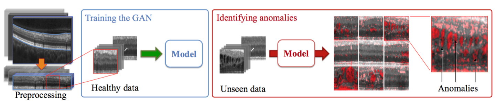
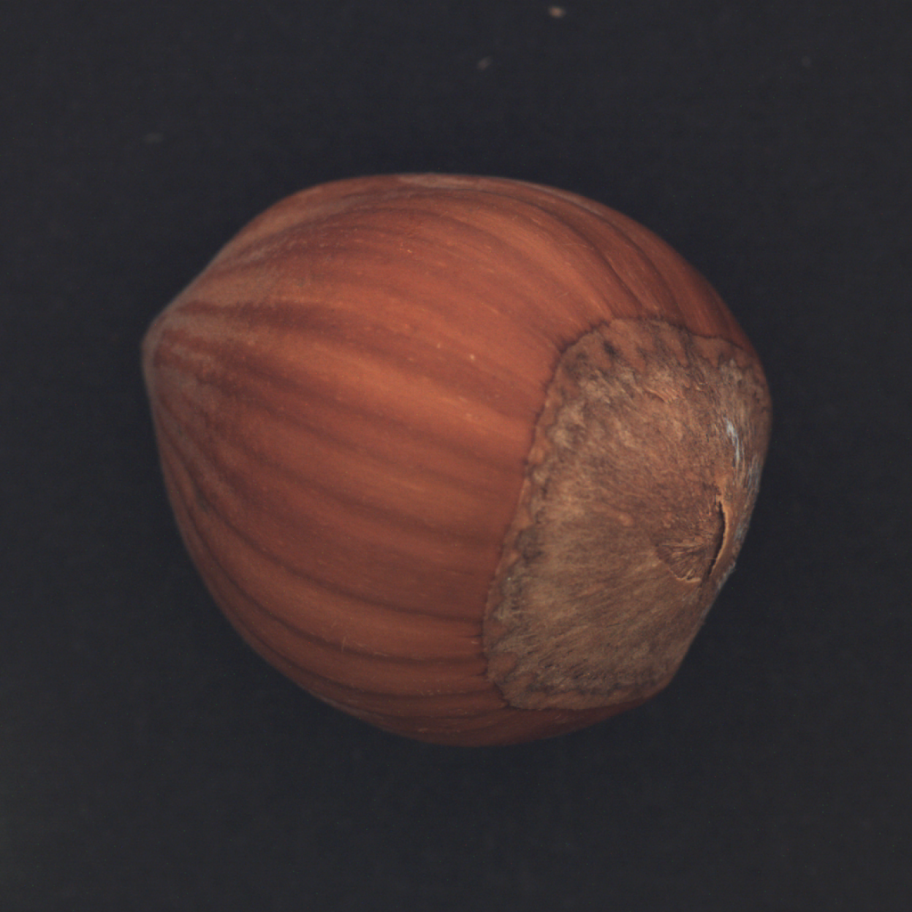
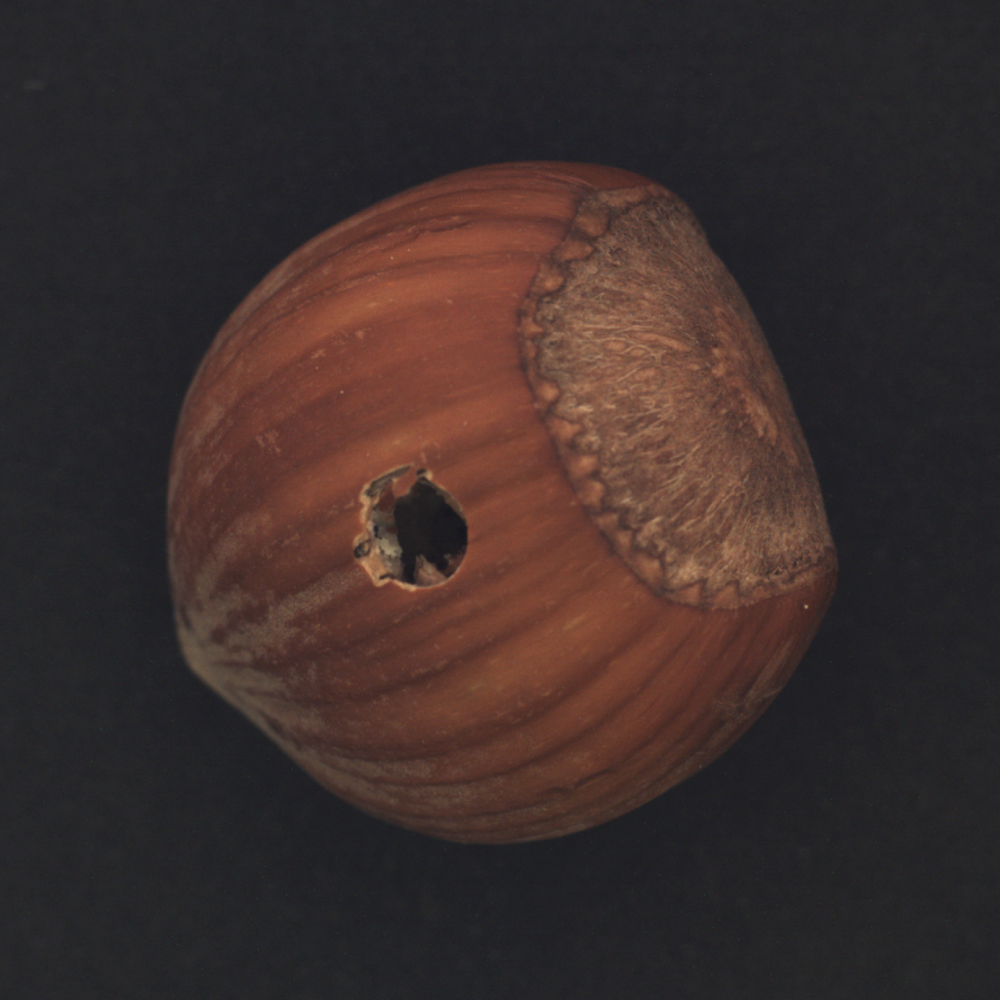
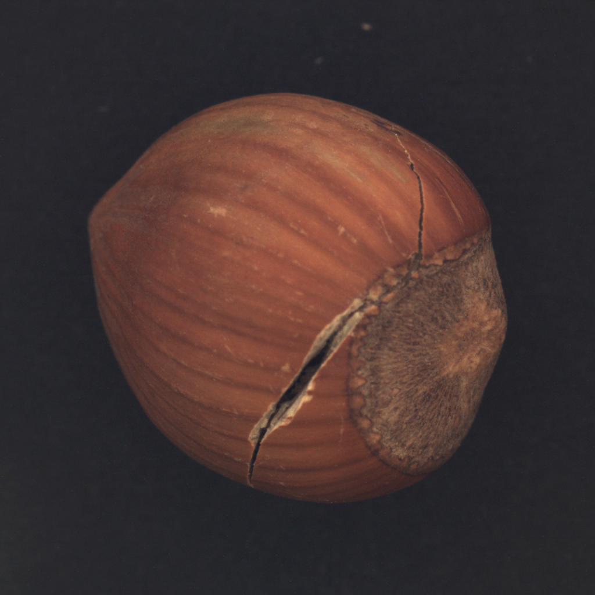
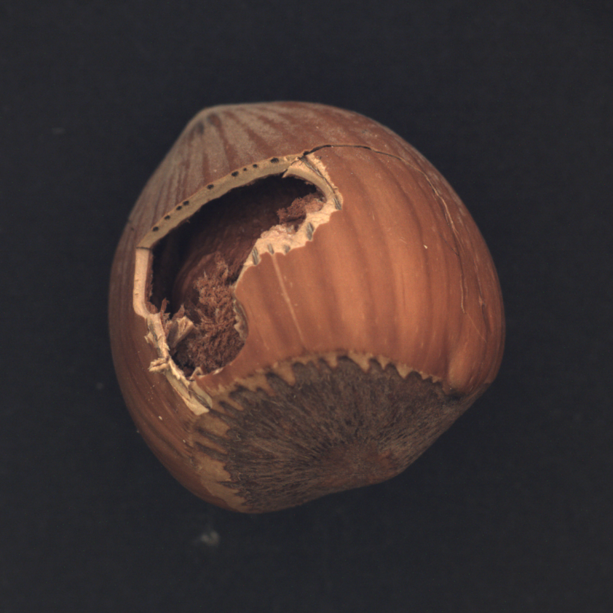
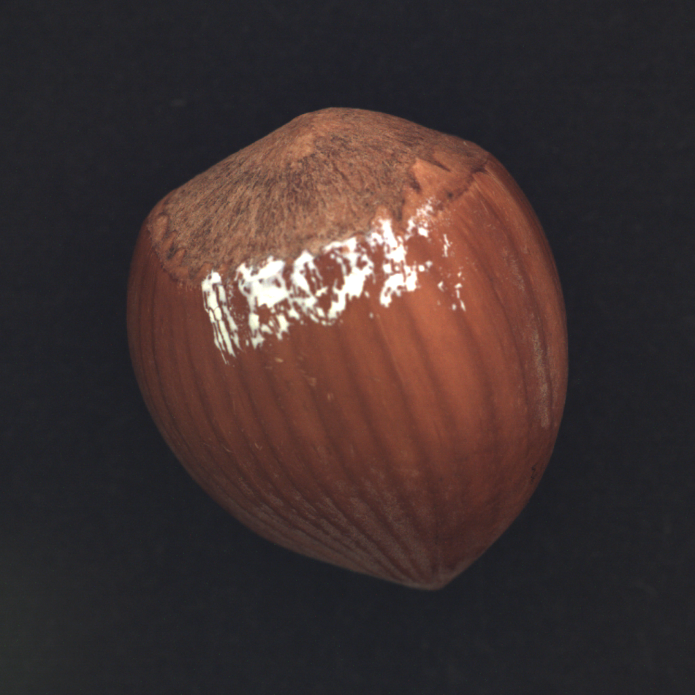
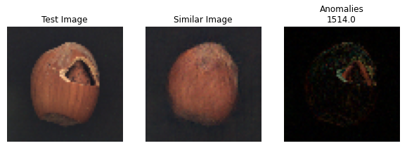
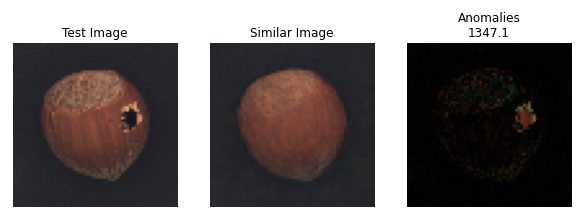
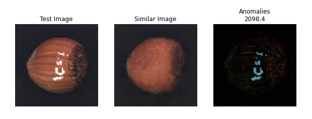

# AnoGAN
Keras implementation of [AnoGAN](https://arxiv.org/abs/1703.05921).

## What is AnoGAN?
AnoGAN is a GAN model for anomaly detection.



It consists of a DCGAN trained on good images to learn the mapping between the latent space and the real images.

To detect images, the model need to learn the inverse mapping. This is done defining two loss:

- Residual loss: $L_R = \|x - G(z)\|_1$
- Discriminator loss: $L_D =\|f(x) - f(G(z)\|_1$ \
Where f is the output of the intermediate layers of the discriminator model.

### Anomaly Score
Anomaly score is the total loss to find the latent representation of an image. This is basically the weighted sum of the two previous loss.

$A(x) = (1 - \lambda) L_R + \lambda L_D$

The reconstruction of an anomalous image will results in a non-anomalous version. 

## Dataset
The dataset used in this project is the [MVTec hazelnut](https://www.mvtec.com/company/research/datasets/mvtec-ad)

    

## Results





## Requirements
- Python 3.9.1
- Tensorflow 2.9.1
- Numpy 1.21.5
- Matplotlib 3.5.1
- tqdm 4.64.0
- IPython 8.3.0
- Jupyter 1.0.0

## Usage
This project hasn't a main yet. To test this architecture is necessary do it by notebook.

First, you need a dataset. It could be any dataset as long as it is normalized in $[-1, 1]$ and well formed in an tf.data.Dataset object. For now the net works only with 64x64 images.

### Libraries
Import the following libraries:
```
from model.dcgan import DCGAN
from model.anogan import AnoGAN

import tensorflow as tf
import numpy as np
import matplotlib.pyplot as plt
```

### Normalization
```
normalization_layer = tf.keras.layers.Rescaling(scale = (1./127.5), offset = -1)

normalized_training_set = training_set.map(lambda x, y: (normalization_layer(x), y))
normalized_test_set = test_set.map(lambda x, y: (normalization_layer(x), y))
```

Set batch size and shuffle.
```
normalized_training_set = normalized_training_set.shuffle(BUFFER_SIZE).batch(BATCH_SIZE)
```

### DCGAN
Create a DCGAN:
```
gan = DCGAN()
```

The constructor requires the image shape and the noise dimension. At the moment the images must have a shape of 64x64 pixels.

### Training
```
dic_loss, gen_loss = gan.train(training_set, EPOCHS)
```

Alternatively, if the dataset is the same of this one, it's possible to load the weights of this projects.
```
gan.generator.load_weights("weights/generator.h5")
gan.discriminator.load_weights("weights/discriminator.h5")
```

### Test

Invoke test method to run anomaly detection
```
results, threshold, accuracy = anogan.test(normalized_test_set)
```

This method returns a dictionary (results) which contains pairs anomaly scores - label (anomalous or not anomalous). It will also calculate a threshold to distinguish real samples from the fake ones.

Grafic results will be stored in the *results* directory.

## To Do List
- [x] Threshold
- [ ] DCGAN with any resolution
- [ ] Method main

## Riferimenti
- Google Developers – GAN https://developers.google.com/machine-learning/gan
- Goodfellow I., Pouget-Abadie J., Mirza M., Xu B., Warde-Farley D., Sherjil O., Courville A., Bengio Y., Generative Adversarial Nets https://arxiv.org/abs/1406.2661
- Radford A., Metz L., Chintala S., Unsupervised Representation Learning with Deep Convolutional Generative Adversarial Networks https://arxiv.org/abs/1511.06434
- Schlegl T., Seebock P., Waldstein S., Schmidt-Erfurth U., Langs G., Unsupervised Anomaly Detection with Generative Adversarial Networks to Guide Marker Discovery https://arxiv.org/abs/1703.05921
- Tensorflow – Deep Convolutional Generative Adversarial Network https://www.tensorflow.org/tutorials/generative/dcgan
