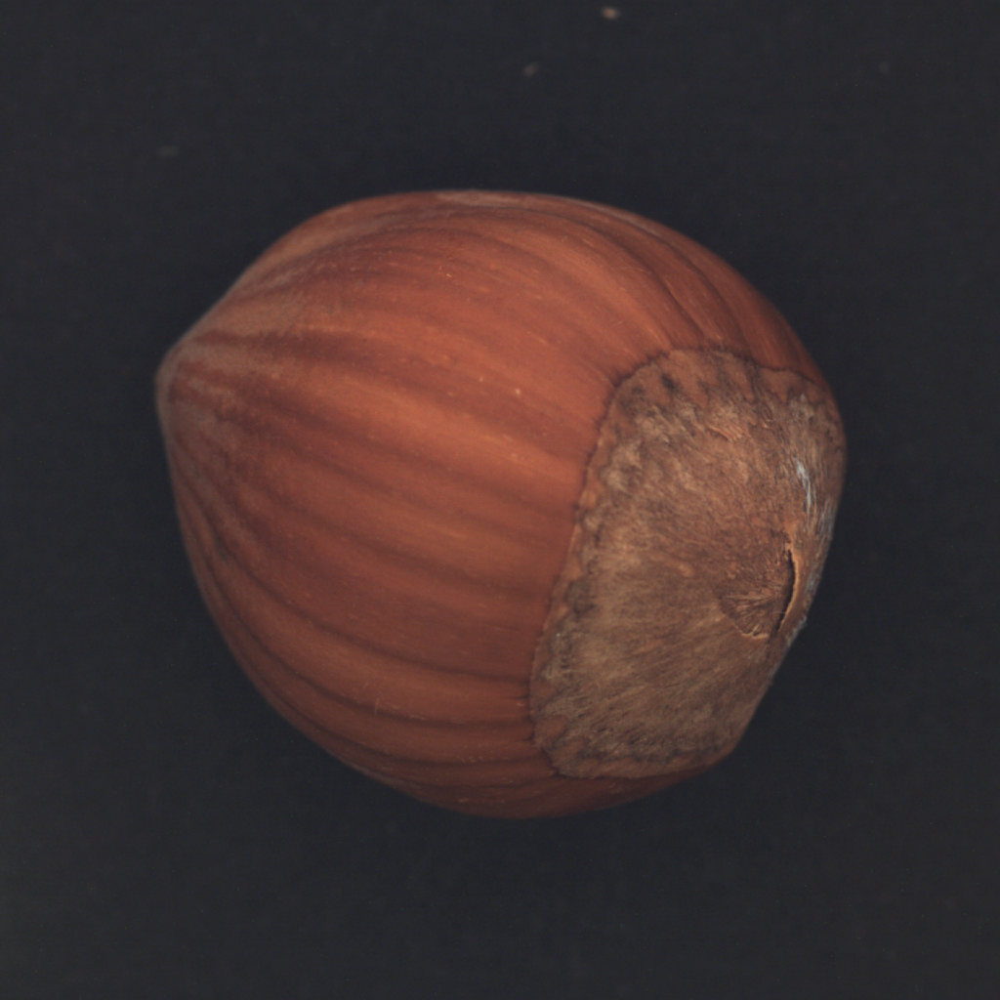
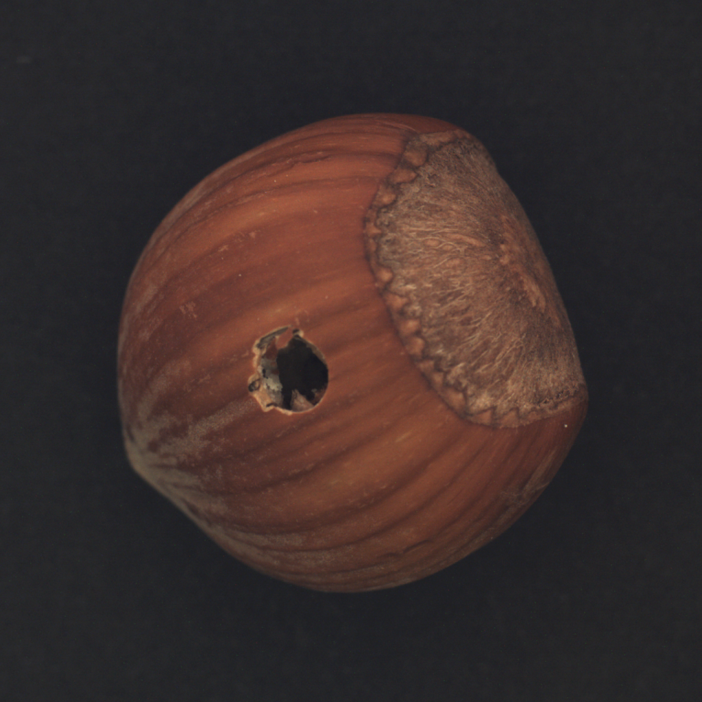
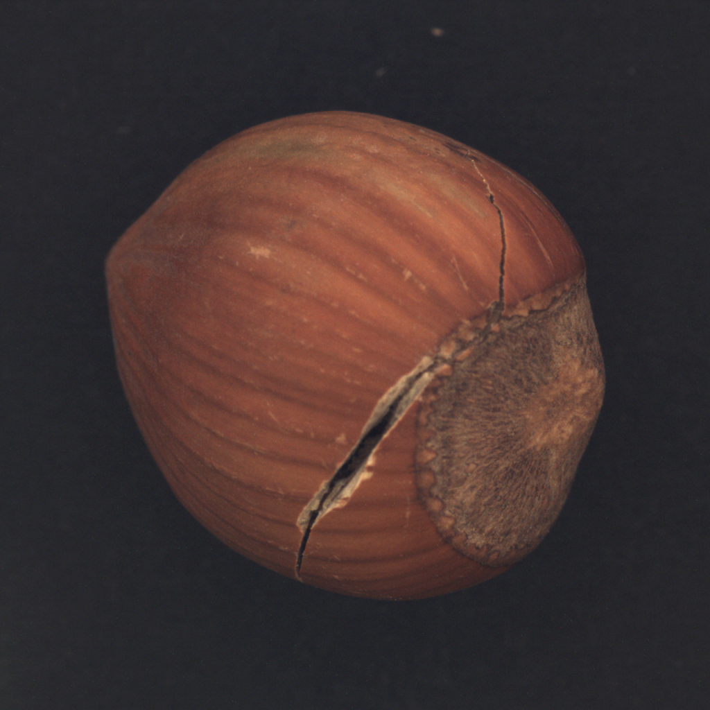
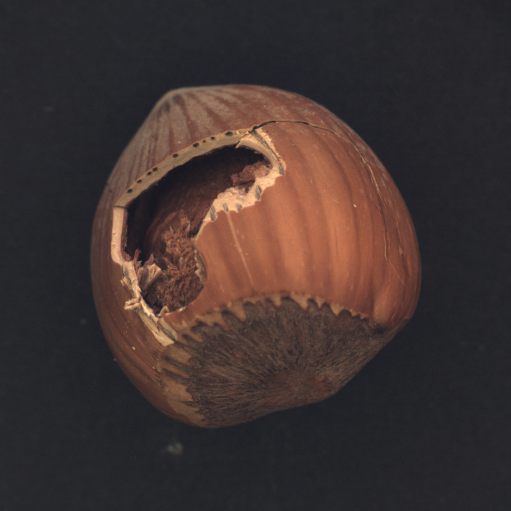
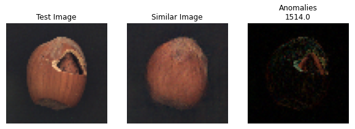
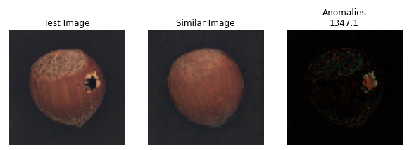
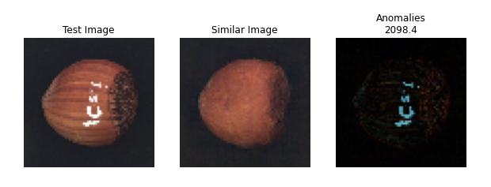

# AnoGAN
Implementazione dell'architettura [AnoGAN](https://arxiv.org/abs/1703.05921) in Keras.

## Cos'è l'AnoGAN
L'AnoGAN è un modello di GAN per l'anomaly detection. 


Utilizza una DCGAN addestrata su immagini normali per apprendere la relazione che associa lo spazio latente alle immagini del dataset (prive di anomalie). 

Per effettuare l'anomaly detection è necessario apprendere anche la relazione inversa. Ciò avviene attraverso due loss:

- Residual loss: $L_R = \|x - G(z)\|_1$
- Discriminator loss: $L_D =\|f(x) - f(G(z)\|_1$ \
Dove f è l'output degli strati intermedi del discriminatore.

### Anomaly Score
Dalla somma pesata di queste due loss si ottiene l'anomaly score, valore che va minimizzato per trovare la rappresentazione latente **z** di un'immagine.

$A(x) = (1 - \lambda) L_R + \lambda L_D$

La ricostruzione di un'eventuale immagine anomala sarà non anomala. Quindi, dalla differenza tra l'immagine di test e la sua ricostruzione si evidenziano le anomalie eventuali.

## Dataset
Il dataset utilizzato è l'[MVTec hazelnut](https://www.mvtec.com/company/research/datasets/mvtec-ad)

    

## Risultati





## Requisiti
- Python 3.9.1
- Tensorflow 2.9.1
- Numpy 1.21.5
- Matplotlib 3.5.1
- tqdm 4.64.0
- IPython 8.3.0
- Jupyter 1.0.0

## Utilizzo
Questo progetto non ha (ancora) un metodo main, perciò non può essere eseguito da terminale. Per testare questa architettura è necessario farlo tramite un notebook.

Per prima cosa è necessario scaricare un dataset su cui testare il modello. Non deve essere necessariamente quello utilizzato in questo notebook, l'importante è che i dati siano normalizzati tra $[-1, 1]$ e che siano costruiti opportunamente gli oggetti Dataset (tf.data.Dataset). Per ora la rete funziona solo con immagini di dimensione 64x64 pixels.

### Librerie
Importare le librerie:
```
from model.dcgan import DCGAN
from model.anogan import AnoGAN

import tensorflow as tf
import numpy as np
import matplotlib.pyplot as plt
```

### Normalizzazione
```
normalization_layer = tf.keras.layers.Rescaling(scale = (1./127.5), offset = -1)

normalized_training_set = training_set.map(lambda x, y: (normalization_layer(x), y))
normalized_test_set = test_set.map(lambda x, y: (normalization_layer(x), y))
```

Dopo aver normalizzato preparo il dataset impostando la dimensione delle batches e lo shuffle:
```
normalized_training_set = normalized_training_set.shuffle(BUFFER_SIZE).batch(BATCH_SIZE)
```

### DCGAN
Creare una DCGAN:
```
gan = DCGAN()
```

Il costruttore richiede in input la dimensione dell'immagine e la dimensione del vettore latente (rumore bianco). Al momento le immagini devono avere una dimensione di 64x64 pixels (volendo si può scegliere se 1 o 3 canali).

### Training
```
dic_loss, gen_loss = gan.train(training_set, EPOCHS)
```

Per questo notebook è stato eseguito un training di circa 2000 epoche.

In alternativa, usando lo stesso dataset di questo progetto è possibile caricare i pesi già disponibili:
```
gan.generator.load_weights("weights/generator.h5")
gan.discriminator.load_weights("weights/discriminator.h5")
```

### Test
Una volta che il modello è stato addestrato, è possibile effettuare l'anomaly detection:
```
results, threshold, accuracy = anogan.test(normalized_test_set)
```

Il test ritorna un dizionario (results) con anomaly score e relativa classificazione (anomala o non anomala) per ogni immagine. Su questo valore vengono anche calcolati una soglia per distinguere gli esempi buoni da quelli difettosi e l'accuratezza della classificazione con questo valore.

I risultati grafici dell'anomaly detection vengono memorizzati in una cartella *results*.

## To Do List
- [x] Calcolo di una soglia tra gli anomaly score
- [ ] DCGAN che vada bene per qualunque dimensione delle immagini
- [ ] Creare un metodo main

## Riferimenti
- Google Developers – GAN https://developers.google.com/machine-learning/gan
- Goodfellow I., Pouget-Abadie J., Mirza M., Xu B., Warde-Farley D., Sherjil O., Courville A., Bengio Y., Generative Adversarial Nets https://arxiv.org/abs/1406.2661
- Radford A., Metz L., Chintala S., Unsupervised Representation Learning with Deep Convolutional Generative Adversarial Networks https://arxiv.org/abs/1511.06434
- Schlegl T., Seebock P., Waldstein S., Schmidt-Erfurth U., Langs G., Unsupervised Anomaly Detection with Generative Adversarial Networks to Guide Marker Discovery https://arxiv.org/abs/1703.05921
- Tensorflow – Deep Convolutional Generative Adversarial Network https://www.tensorflow.org/tutorials/generative/dcgan
